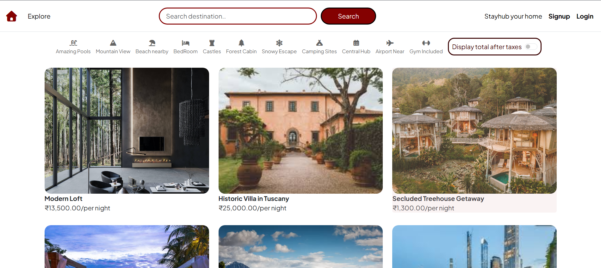
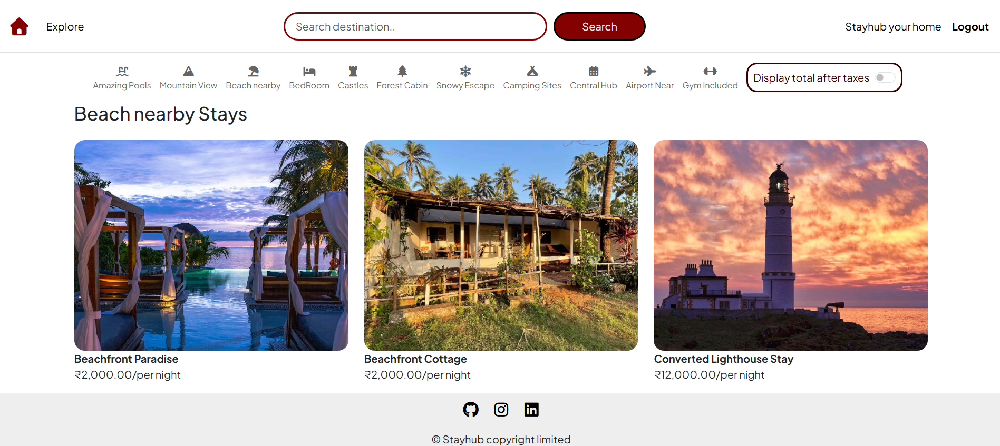
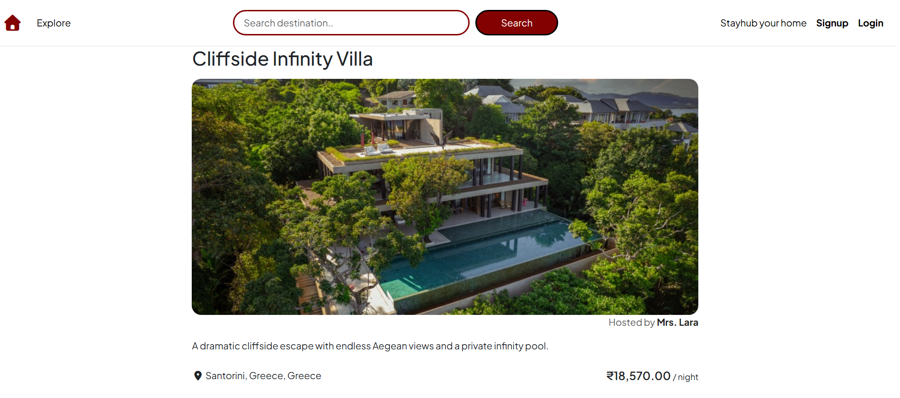
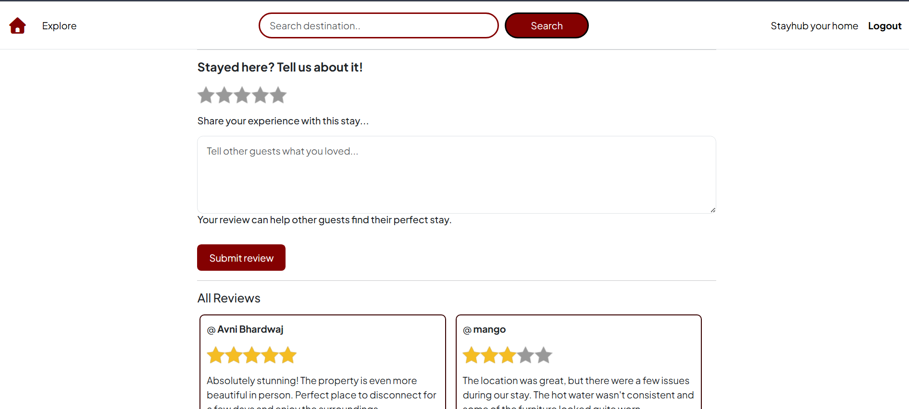
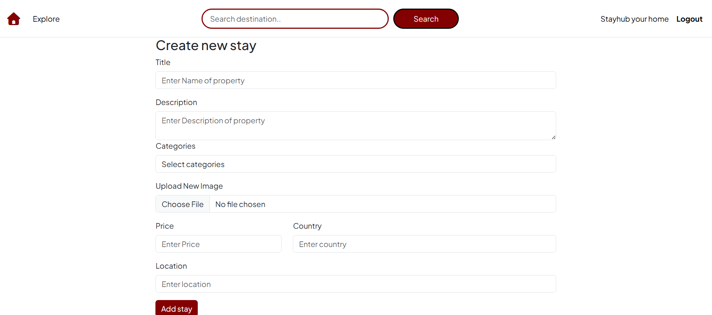
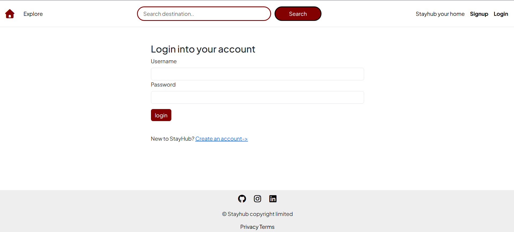

# StayHub

A full-stack rental platform for discovering, creating, and managing property listings.

## About the Project

StayHub is a full-stack web application inspired by modern rental platforms. It allows users to browse and search for stays, explore listings by category, view detailed property information, and manage their own listings.

The application also includes user authentication, reviews and ratings, image uploads, and authorization for user-specific actions. StayHub follows an MVC architecture with a Node.js and Express.js backend, MongoDB for data storage, and EJS for server-side rendering.

The application is deployed and uses MongoDB Atlas for the production database, Cloudinary for image storage, and Render for hosting.

## Live Demo

[View StayHub](https://stayhub-wq1q.onrender.com/listings)

## 📸 Screenshots

### Home

### Category Filtering

### Listing Details

### Reviews & Ratings

### Create Listing

### Authentication

